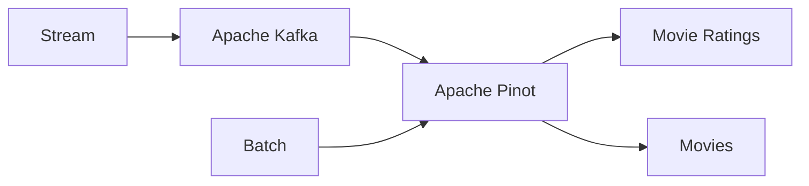

# Apache Pinot™ Quickstart

Welcome to the Apache Pinot quickstart.

Here are the steps we'll take:

* Start a development cluster locally with Docker
* Ingest batch data
* Ingest streaming data
* Join the two data sources together and compute a real-time aggregation

<!-- TOC -->
* [Pinot Getting Started Guide](#pinot-getting-started-guide)
  * [Architecture Diagram](#architecture-diagram-)
  * [A Quick Shortcut](#a-quick-shortcut)
  * [Step-by-Step Details](#step-by-step-details)
    * [Step 1: Build and Launch with Docker](#step-1-build-and-launch-with-docker)
    * [Step 2: Create a Kafka Topic](#step-2-create-a-kafka-topic)
    * [Step 3: Configure Pinot Tables](#step-3-configure-pinot-tables)
    * [Step 4: Load Data into the Movies Table](#step-4-load-data-into-the-movies-table)
    * [Step 5: Apache Pinot Advanced Usage](#step-5-apache-pinot-advanced-usage)
  * [Clean Up](#clean-up)
  * [Troubleshooting](#troubleshooting)
  * [Further Reading](#further-reading)
<!-- TOC -->

## Architecture Diagram 



## A Quick Shortcut

To quickly see the demonstration in action, you can use the following command:

```bash
make
```

For a detailed step-by-step setup, please refer to the [Step-by-Step Details](#step-by-step-details) section.

If you're ready to explore the advanced features, jump directly to the [Apache Pinot Advanced Usage](#step-5-apache-pinot-advanced-usage) section to run a multi-stage join between the ratings and movies tables.

## Step-by-Step Details

This section provides detailed instructions to get the demonstration up and running from scratch.

### Step 1: Build and Launch with Docker

Apache Pinot queries real-time data through streaming platforms like Apache Kafka. 
This setup includes a mock stream producer using Python to write data into Kafka.

First, build the producer image and start all services using the following commands:

```bash
docker compose build --no-cache

docker compose up -d
```

The `docker-compose.yml` file configures the following services:

- Zookeeper (dedicated to Pinot)
- Pinot Controller, Broker, and Server
- Kraft (Zookeeperless Kafka)
- Python producer

### Step 2: Create a Kafka Topic

Next, create a Kafka topic for the producer to send data to, which Pinot will then read from:

```bash
docker exec -it kafka kafka-topics.sh \
    --bootstrap-server localhost:9092 \
    --create \
    --topic movie_ratings
```

To verify the stream, check the data flowing into the Kafka topic:

```bash
docker exec -it kafka \
    kafka-console-consumer.sh \
    --bootstrap-server localhost:9092 \
    --topic movie_ratings
```

### Step 3: Configure Pinot Tables

In Pinot, create two types of tables:

1. A REALTIME table for streaming data (`movie_ratings`).
2. An OFFLINE table for batch data (`movies`).

To query the Kafka topic in Pinot, we add the real-time table using the `pinot-admin` CLI, providing it with a [schema](./table/ratings.schema.json) and a [table configuration](./table/ratings.table.json). 
The table configuration contains the connection information to Kafka.

```bash
docker exec -it pinot-controller ./bin/pinot-admin.sh \
    AddTable \
    -tableConfigFile /tmp/pinot/table/ratings.table.json \
    -schemaFile /tmp/pinot/table/ratings.schema.json \
    -exec
```

At this point, you should be able to query the topic in the Pinot [console](http://localhost:9000/#/query?query=select+*+from+movie_ratings+limit+10&tracing=false&useMSE=false).

We now do the same for the OFFLINE table using this [schema](table/movies.schema.json) and [table configuration](table/movies.table.json).

```bash
docker exec -it pinot-controller ./bin/pinot-admin.sh \
    AddTable \
    -tableConfigFile /tmp/pinot/table/movies.table.json \
    -schemaFile /tmp/pinot/table/movies.schema.json \
    -exec
```

Once added, the OFFLINE table will not have any data.
Let's add data in the next step.


### Step 4: Load Data into the Movies Table

Use the following command to load data into the OFFLINE movies table:

```bash
docker exec -it pinot-controller ./bin/pinot-admin.sh \
    LaunchDataIngestionJob \
    -jobSpecFile /tmp/pinot/table/jobspec.yaml
```

Now, both the REALTIME and OFFLINE tables are queryable.

### Step 5: Apache Pinot Advanced Usage

To perform complex queries such as joins, open the Pinot console [here](http://localhost:9000/#/query) and enable `Use Multi-Stage Engine`. Example query:

```sql
select
    r.rating latest_rating,
    m.rating initial_rating,
    m.title,
    m.genres,
    m.releaseYear
from movies m
         left join movie_ratings r on m.movieId = r.movieId
where r.rating > .9
order by r.rating desc
    limit 10
```


## Clean Up

To stop and remove all services related to the demonstration, run:

```bash
docker compose down
```

## Troubleshooting

If you encounter "No space left on device" during the Docker build process, you can free up space with:

```bash
docker system prune -f
```

## Further Reading

For more detailed tutorials and documentation, visit the StarTree developer page [here](https://dev.startree.ai/)
