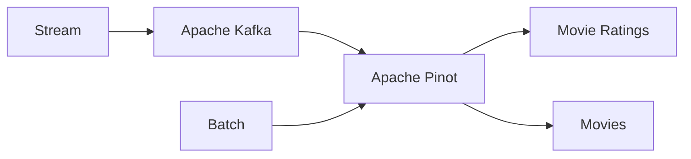

# Pinot Getting Started

This repository gets you started with Apache Pinot. It loads two sources of data: a real-time stream of movie ratings and a batch source of movies. The two data sets can be joined together in Apache Pinot.



## Makefile
To simplify seeding Apache Pinot, define all the commands to create the Pinot tables and load them with data in a [Makefile](./Makefile). Run the all using the single command below.

```bash
make all
```

## Apache Pinot

Click to open the Pinot console [here](http://localhost:9000/#/query). To perform a join, you'll need to select the `Use Multi-Stage Engine` before clicking on `RUN QUERY`.

```sql
select 
    r.rating latest_rating, 
    m.rating initial_rating, 
    m.title, 
    m.genres, 
    m.releaseYear 
from movies m
left join movie_ratings r on m.movieId = r.movieId
where r.rating > .9
order by r.rating desc
limit 10

```

You should see a similar result:


To destroy they demo, run the command below.

```bash
docker compose down
```

## Trouble Shooting

If you get "No space left on device" when executing docker build.

```docker system prune -f```


## Getting Started

Get started for yourself by visiting StarTree developer page [here](https://dev.startree.ai/docs/pinot/getting-started/quick-start)
