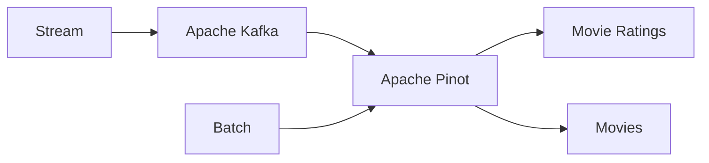

# Pinot Getting Started

This repository gets you started with Apache Pinot. It loads two sources of data: a real-time stream of movie ratings and a batch source of movies. The two data sets can be joined together in Apache Pinot.



## Just Run It

Use `make` to just see the demonstration run. Run the command below. To delve into the setup, go to [step by step](#step-by-step) section.

```bash
make base
```

Skip to the [Apache Pinot](#apache-pinot) section to run the `multi-stage` join between the ratings and movies table.

## Step-By-Step Details

This section is a step-by-step outline of the process to get this demonstration running. It describes the steps in more detail.

### Step 1 - Build and Compose Up with Docker

Apache Pinot's can query real-time streaming data flowing through streaming platforms like Apache Kafka.

To mock streaming data, this quick start has a built-in stream producer that writes to Kafka using Python. All Python-related details for this producer can be found in its [Dockerfile](docker/producer/Dockerfile).

Build the producer image and start all the services by running these commands.

```bash
docker compose build --no-cache

docker compose up -d
```

The [docker-compose](./docker-compose.yml) file starts up these containers:

- Dedicated Zookeeper for Pinot
- Pinot Controller
- Pinot Broker
- Pinot Server
- Kraft "Zookeeperless" Kafka
- The python producer


### Step 2 - Create a Kafka Topic

Create the Kafka topic for the producer to write into and for the Pinot table to read from.

```bash
docker exec -it kafka kafka-topics.sh \
    --bootstrap-server localhost:9092 \
    --create \
    --topic movie_ratings
```

At this point, the producer should be sending data to a topic in Kafka called `movie_ratings`. You can test this by running the command below.

```bash
docker exec -it kafka \
    kafka-console-consumer.sh \
    --bootstrap-server localhost:9092 \
    --topic movie_ratings
```

### Step 3 - Create the Pinot Tables

There are two tables we need to create in Pinot:

- A REALTIME table called `movie_ratings`.
- An OFFLINE table called `movies`.

To query the Kafka topic in Pinot, we add the real-time table using the `pinot-admin` CLI, providing it with a [schema](./table/ratings.schema.json) and a [table configuration](./table/ratings.table.json). The table configuration contains the connection information to Kafka.

```bash
docker exec -it pinot-controller ./bin/pinot-admin.sh \
    AddTable \
    -tableConfigFile /tmp/pinot/table/ratings.table.json \
    -schemaFile /tmp/pinot/table/ratings.schema.json \
    -exec
```

At this point, you should be able to query the topic in the Pinot [console](http://localhost:9000/#/query?query=select+*+from+movie_ratings+limit+10&tracing=false&useMSE=false).

We now do the same for the OFFLINE table using this [schema](table/movies.schema.json) and [table configuration](table/movies.table.json).

```bash
docker exec -it pinot-controller ./bin/pinot-admin.sh \
    AddTable \
    -tableConfigFile /tmp/pinot/table/movies.table.json \
    -schemaFile /tmp/pinot/table/movies.schema.json \
    -exec
```

Once added, the OFFLINE table will not have any data. Let's add data in the next step.

### Step 4 - Load the Movies Table

We again leverage the `pinot-admin.sh` CLI to load data into an OFFLINE table.

```bash
docker exec -it pinot-controller ./bin/pinot-admin.sh \
    LaunchDataIngestionJob \
    -jobSpecFile /tmp/pinot/table/jobspec.yaml
```

In this command, we use a YAML [file](table/jobspec.yaml) that provides the specification for loading the [movies data](data/movies.json). Once this job is completed, you can query the movies table [here](http://localhost:9000/#/query?query=select+*+from+movies+limit+10&tracing=false&useMSE=false).

Now that you can query both the REALTIME and OFFLINE tables, you can perform a JOIN query in the next section.

## Apache Pinot

Click to open the Pinot console [here](http://localhost:9000/#/query). To perform a join, you'll need to select the `Use Multi-Stage Engine` before clicking on `RUN QUERY`.

```sql
select 
    r.rating latest_rating, 
    m.rating initial_rating, 
    m.title, 
    m.genres, 
    m.releaseYear 
from movies m
left join movie_ratings r on m.movieId = r.movieId
where r.rating > .9
order by r.rating desc
limit 10

```

You should see a similar result:


## Clean Up

To destroy the demo, run the command below.

```bash
docker compose down
```

## Trouble Shooting

If you get "No space left on device" when executing docker build.

```docker system prune -f```


## Getting Started

Get started for yourself by visiting StarTree developer page [here](https://dev.startree.ai/docs/pinot/getting-started/quick-start)
