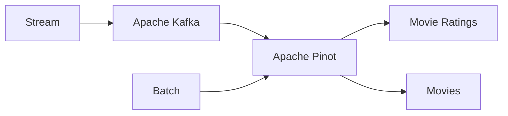

# Apache Pinot™ quickstart readme

Run the Apache Pinot™ quickstart in this repository to load one streaming data source (`movie_ratings`) and one batch data source (`movies`). 

Then, see how to view, join, and query this data in Pinot.

- [Apache Pinot™ quickstart readme](#apache-pinot-quickstart-readme)
  - [Quickstart workflow diagram](#quickstart-workflow-diagram)
  - [Run the Pinot quickstart](#run-the-pinot-quickstart)
    - [Run the Pinot quickstart automatically](#run-the-pinot-quickstart-automatically)
    - [Run the Pinot quickstart manually](#run-the-pinot-quickstart-manually)
      - [Step 1: Build and launch with Docker](#step-1-build-and-launch-with-docker)
      - [Step 2: Create a Kafka topic](#step-2-create-a-kafka-topic)
      - [Step 3: Configure Pinot tables](#step-3-configure-pinot-tables)
      - [Step 4: Load data into the movies table](#step-4-load-data-into-the-movies-table)
  - [View, join, and query data in Pinot](#view-join-and-query-data-in-pinot)
  - [Clean up](#clean-up)
  - [Troubleshooting](#troubleshooting)
  - [Learn more about getting started with Pinot](#learn-more-about-getting-started-with-pinot)
 
## Quickstart workflow diagram



## Run the Pinot quickstart

1. In terminal, clone this repository. For example, run: `git clone https://github.com/startreedata/pinot-quickstart.git`
2. [Install Docker](https://docs.docker.com/get-docker/). 
3. Choose one of the following options:
   - [**Run the Pinot quickstart automatically**](#run-the-pinot-quickstart-automatically). Use this option to immediately load streaming and batch data in Pinot.
   - [**Run the Pinot quickstart manually**](#run-the-pinot-quickstart-manually). Use this option to go step-by-step through the quickstart to see how it works.

### Run the Pinot quickstart automatically

To run the quickstart automatically, run the following:

```bash
 cd pinot-quickstart
 make
```

Now, skip to [view, join, and query data in Pinot](#view-join-and-query-data-in-pinot).

### Run the Pinot quickstart manually

To run the quickstart manually, complete the following steps:
- [Step 1: Build and compose up with Docker](#step-1-build-and-compose-up-with-docker)
- [Step 2: Create a Kafka topic](#step-2-create-a-kafka-topic)
- [Step 3: Create the Pinot tables](#step-3-create-the-pinot-tables)
- [Step 4: Load the movies table](#step-4-load-the-movies-table)

#### Step 1: Build and launch with Docker

Pinot queries real-time streaming data from platforms like Apache Kafka.
This setup includes a mock stream producer using Python to write data into Kafka.

To build the producer image and start all services, run the following:

```bash
cd pinot-quickstart
docker compose build --no-cache
docker compose up -d
```

The [docker-compose](./docker-compose.yml) file configures the following services:

- Zookeeper (dedicated to Pinot)
- Pinot Controller, Broker, and Server
- Kraft (Zookeeperless Kafka)
- Python producer

#### Step 2: Create a Kafka topic

Create a Kafka topic for the producer to send data to, which Pinot will then read from:

```bash
docker exec -it kafka kafka-topics.sh \
    --bootstrap-server localhost:9092 \
    --create \
    --topic movie_ratings
```

To test the stream, verify data is flowing into the Kafka topic:

```bash
docker exec -it kafka \
    kafka-console-consumer.sh \
    --bootstrap-server localhost:9092 \
    --topic movie_ratings
```

#### Step 3: Configure Pinot tables

In Pinot, create the following two tables:

- A REALTIME table for streaming data (`movie_ratings`) (contains information to connect to Kafka)
- An OFFLINE table for batch data (`movies`)

**To add the real-time table**, use the `pinot-admin` CLI to provide a [schema](./table/ratings.schema.json) 
and [table configuration](./table/ratings.table.json). To do this, run the following:

```bash
docker exec -it pinot-controller ./bin/pinot-admin.sh \
    AddTable \
    -tableConfigFile /tmp/pinot/table/ratings.table.json \
    -schemaFile /tmp/pinot/table/ratings.schema.json \
    -exec
```

Now you can query the Kafka topic in the [Pinot console](http://localhost:9000/#/query?query=select+*+from+movie_ratings+limit+10&tracing=false&useMSE=false).

**To create the OFFLINE table**, use `pinot-admin` CLI to provide a [schema](table/movies.schema.json)
and [table configuration](table/movies.table.json). To do this, run the following:

```bash
docker exec -it pinot-controller ./bin/pinot-admin.sh \
    AddTable \
    -tableConfigFile /tmp/pinot/table/movies.table.json \
    -schemaFile /tmp/pinot/table/movies.schema.json \
    -exec
```

The OFFLINE table has no data. Let's add data in the next step.

#### Step 4: Load data into the movies table

To load data into the OFFLINE table, run the following:

```bash
docker exec -it pinot-controller ./bin/pinot-admin.sh \
    LaunchDataIngestionJob \
    -jobSpecFile /tmp/pinot/table/jobspec.yaml
```
Now, both the REALTIME and OFFLINE tables are queryable, and you're ready to view, join, and query data in Pinot.

## View, join, and query data in Pinot

1. Open the [Pinot console](http://localhost:9000/#/query). 
2. Click the **movies** and **movie_ratings** links to view data stored in each table. 
3. To join the two datasets, do the following:
   - Select the `Use Multi-Stage Engine` check box.
   - Enter the following query under `SQL Editor`:

        ```sql
        select 
            r.rating latest_rating, 
            m.rating initial_rating, 
            m.title, 
            m.genres, 
            m.releaseYear 
        from movies m
        left join movie_ratings r on m.movieId = r.movieId
        where r.rating > .9
        order by r.rating desc
        limit 10

        ```

4. Click `RUN QUERY`.

    

## Clean up

To stop and remove all quickstart services, run the following command:

```bash
cd pinot-quickstart
docker compose down -v
```

## Troubleshooting

If you encounter "No space left on device" during the Docker build process, you can free up space with:

```bash
docker system prune -f
```

## Learn more about getting started with Pinot

To learn more about getting started with Pinot, see [StarTree documentation](https://dev.startree.ai/docs/pinot/getting-started/quick-start).
